# CaptureCadence

**Scheduled full-page website screenshot automation.**

[](https://github.com/ry-ops/capture-cadence)
[](https://nodejs.org)
[](https://docker.com)
[](./LICENSE)

> **Note:** This project is archived and no longer in active development or production use. The codebase is preserved as-is for reference.

---

## What is CaptureCadence?

CaptureCadence is a lightweight tool that takes full-page screenshots of websites on a configurable schedule. Add any URL, set an interval in minutes, and it automatically captures the page using Puppeteer's headless Chrome, saving the result as an efficient WebP image.

It was built for monitoring website changes, creating visual dashboards, and archiving periodic snapshots of web content.

---

## How It Works

<p align="center">
  
</p>

1. User adds a site via the web UI (URL, interval, save path, filename)
2. Express server stores the config in `urls.json` and schedules a `setInterval`
3. When the interval fires, Puppeteer launches headless Chrome
4. Navigates to the URL, waits for `networkidle0` (all requests complete)
5. Takes a full-page screenshot in WebP format
6. Saves to the configured directory — on restart, all jobs reload automatically

---

## Components

<p align="center">
  
</p>

| Component | Description |
|-----------|-------------|
| **Express Server** | HTTP server on port 3000, serves UI, handles API requests, manages scheduler |
| **Puppeteer Engine** | Headless Chrome automation — full-page capture with network idle detection |
| **Web UI** | Minimal form-based interface for adding screenshot jobs |
| **urls.json** | File-based persistence — jobs survive server restarts |
| **Docker** | Containerized deployment with volume mount for screenshot output |

---

## Features

- Full-page screenshots of any URL using headless Chrome
- Per-site configurable intervals (in minutes)
- Custom save paths and filenames
- WebP format for efficient storage
- Persistent job configuration (survives restarts)
- Docker-ready with volume mount support
- Overwrite mode (fixed filename) or accumulate mode (timestamped)

---

## Project Structure

```
capture-cadence/
├── server.js          # Express server, scheduler, API endpoints
├── puppeteer.js       # Headless Chrome screenshot capture logic
├── urls.json          # Persistent job configuration
├── ui/
│   └── index.html     # Web interface
├── Dockerfile         # Docker build (Node.js 20)
├── package.json       # Dependencies (express, puppeteer, body-parser)
└── docs/              # Architecture diagrams
```

---

## Tech Stack

| Category | Technology |
|----------|-----------|
| **Runtime** | Node.js 18+ |
| **Server** | Express.js |
| **Browser** | Puppeteer (headless Chrome) |
| **Image Format** | WebP |
| **Persistence** | File-based (urls.json) |
| **Deployment** | Docker (Node.js 20 base) |

---

## API

| Endpoint | Method | Description |
|----------|--------|-------------|
| `/` | GET | Serves the web UI |
| `/add-site` | POST | Add a screenshot job (`{url, interval, savePath, baseName}`) |
| `/screenshots/*` | GET | Serves captured screenshot files |

---

## License

[MIT](./LICENSE)
