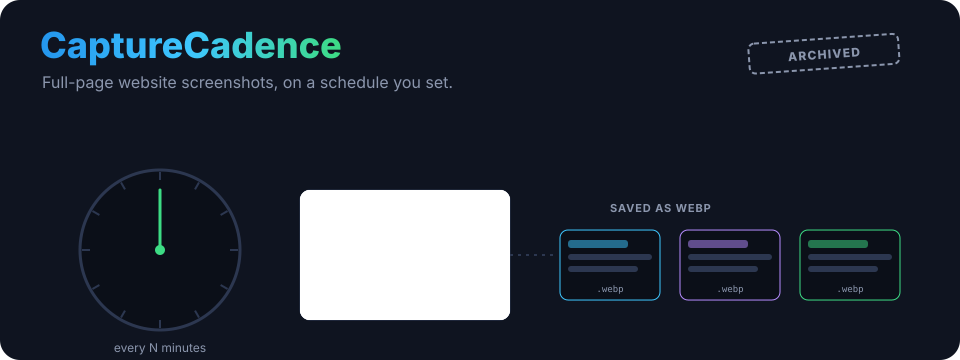
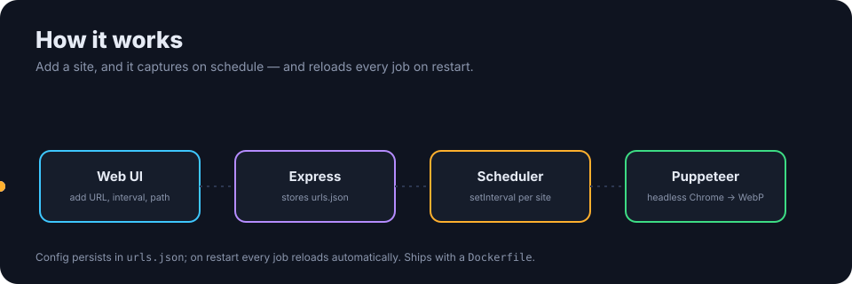

<p align="center">
  
</p>

<h1 align="center">CaptureCadence</h1>

<p align="center"><b>Scheduled full-page website screenshots.</b> Add a URL, set an interval, and it captures the page with headless Chrome and saves an efficient WebP — on repeat.</p>

<p align="center">
  
  <a href="https://nodejs.org/"></a>
  
  
  <a href="LICENSE"></a>
</p>

> [!NOTE]
> **Archived** — no longer developed or run; kept as-is for reference. Its dependencies are unmaintained, so read it and borrow from it, but don't deploy it unchanged.

---

## What it did

Full-page screenshots of any website on a schedule: good for watching a page change over time, building visual dashboards, or archiving periodic snapshots. Each capture is saved as a WebP to keep files small.

## How it works

<p align="center">
  
</p>

1. Add a site in the **web UI** — URL, interval (minutes), save path, filename.
2. The **Express** server stores the config in `urls.json` and schedules a `setInterval`.
3. When it fires, **Puppeteer** launches headless Chrome, navigates, and waits for `networkidle0`.
4. It takes a **full-page screenshot** and saves it as **WebP** to your directory.
5. On restart, every job **reloads from `urls.json`** automatically.

## Run it

```bash
git clone https://github.com/ry-ops/capture-cadence.git
cd capture-cadence
npm install
node server.js      # web UI + scheduler
```

<details>
<summary><b>Docker</b></summary>

```bash
docker build -t capture-cadence .
docker run -p 3000:3000 -v "$PWD/screenshots:/app/screenshots" capture-cadence
```
</details>

```
server.js        Express server, scheduler, API
puppeteer.js     the capture routine
ui/index.html    the web UI
urls.json        persisted site configs
```

## License

MIT. See [LICENSE](LICENSE).

<!-- org-footer -->
---

<p align="center"><sub>Part of <a href="https://github.com/ry-ops">ry-ops</a> · building the pipes between infrastructure, automation, and observability · built by <a href="https://github.com/ry-ops">ry-ops</a></sub></p>
